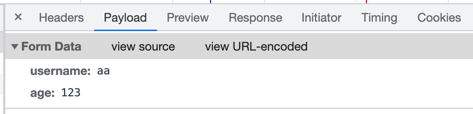
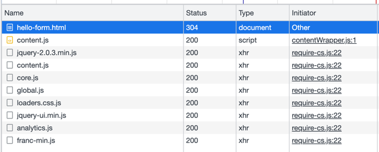

<div align="center">
    <h2>스프링MVC 1편</h2>
</div>

#### http 요청 로그 남기기
- `logging.level.org.apache.coyote.http11=debug` application.properties에 추가
- 단 성능저하를 일으킬 수 있으므로 운영 서버에는 적용시키지 않는 것을 추천

#### HttpServletRequest 개요
- HTTP 요청 메시지를 대신해서 파싱해준다.
- 그 결과를 `HttpServletRequest`객체에 담아서 제공해준다.

- start line
  - HTTP 메서드
  - URL
  - 쿼리 스트링
  - 스키마, 프로토콜
- 헤더
  - 헤더 조회
- 바디
  - form 파라미터 형식 조회
  - mwssage body 데이터 직접 조회

- 임시 저장소 기능
  - 저장: `request.setAttribute(name, value)`
  - 조회: `request.getAttribute(name)`
- 세션 관리 기능
  - `request.getSession(create: true)`

#### HTTP 요청 데이터 개요
- GET : 쿼리 파라미터
- POST : HTML Form
- HTTP message body : 데이터 형식은 주로 JSON을 사용

- 복수 파라미터에서 단일 파라미터 조회
  - `username=sim&username=kim` 인 경우 `request.getParameter()`는 하나의 파라미터만 조회가 가능하므로 `request.getParameterValues()` 를 사용해야 한다.

#### POST HTML Form
- application/x-www-form-urlencoded 형식은 쿼리 파라미터 형식과 동일하다.
- 따라서 쿼리 파리미터 조회 메서드를 그대로 사용하면 된다.
- 즉 `request.getParameter()` 메서드는 GET URL 쿼리 파라미터 형식, POST HTML Form 형식 둘 다 지원하는 것이다.


- POST 방식만 가능하다.
- 단 히든 필드를 스프링이 조회해서 PUT, PATCH 같은 요청들을 마치 동작되는 것처럼 보여주기도 한다.
  - 실은 POST 방식으로 동작하는 것이다.

#### JSON 바디
- JSON 결과를 파싱해서 사용할 수 있는 자바 객체로 변환하려면 Jackson, Gson같은 변환 라이브러리를 추가해서 사용해야 한다.
- 스프링 부트로 Spring MVC를 선택하면 기본으로 Jackson을 제공한다. 

#### HttpServletResponse 기본 사용법
- HTTP 응답코드 지정
- 헤더 생성
- 바디 생성

- 편의 기능 제공
- content-type, 쿠키, Redirect

- response 헤더에 편의 메서드를 사용하여 여러 값들을 지정할 수 있다.
- 쿠키는 쿠키의 명칭과 값, 그리고 쿠키의 유지시간을 설정 할 수 있다.
```java
    private void cookie(HttpServletResponse response) {
//        Set-Cookie: myCookie=good; Max-Age=600;
//        response.setHeader("Set-Cookie", "myCookie=good; Max-Age=600");
        Cookie cookie = new Cookie("myCookie", "good");
        cookie.setMaxAge(600); // 쿠키 유지시간 600초
        response.addCookie(cookie);
    }
```

- 리다이렉트 정보도 저장할 수 있다.
  - 이때 웹 브라우저는 캐시에 있는 정보를 사용하기 때문에 같은 요청을 보낸 경우 변동 사항이 없으므로 304 코드를 반환한다.
  

#### HTTP 응답 데이터 - 단순 텍스트, HTML
- 단순 텍스트 응답
  - `writer.println("ok");`
- HTML 응답
  - html을 반환할 때는 content-type을 `text/html`로 지정해야 한다.
- HTTP API, Message Body JSON 응답
  - ObjectMapper를 사용하여 객체를 JSON 형태로 변환하여 반환시킬 수 있다.
  ```java
    @Override
    protected void service(HttpServletRequest request, HttpServletResponse response) throws ServletException, IOException {
        // Content-Type : application/json
        response.setContentType("application/json");
        response.setCharacterEncoding("utf-8");

        HelloData helloData = new HelloData();
        helloData.setUsername("sim");
        helloData.setAge(26);

        // {"username" : "sim", "age" : 26}
        String result = objectMapper.writeValueAsString(helloData);
        response.getWriter().write(result);

    }
  ```

#### 서블릿과 자바 코드만으로 HTML 만들기
- 서블릿 덕분에 동적으로 원하는 HTML을 만들 수 있었다. 
- 하지만 HTML을 자바로 작성하는 것은 복잡하고 비효율적이다.
```java
        w.write("<html>\n" +
                "<head>\n" +
                " <meta charset=\"UTF-8\">\n" + "</head>\n" +
                "<body>\n" +
                "성공\n" +
                "<ul>\n" +
                "    <li>id=" + member.getId() + "</li>\n" +
                "    <li>username=" + member.getUsername() + "</li>\n" +
                " <li>age=" + member.getAge() + "</li>\n" + "</ul>\n" +
                "<a href=\"/index.html\">메인</a>\n" + "</body>\n" +
                "</html>");
```

- 따라서 HMTL문서에 동적으로 변경해야 하는 부분에 자바 코드를 넣을 수 있는 방법이 생겨났다.
- 이를 템플릿 엔진이라고 하고 그 예로 JSP, Thymeleaf, Freemarker, Velocity 등이 있다.

