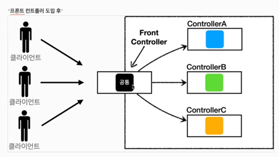
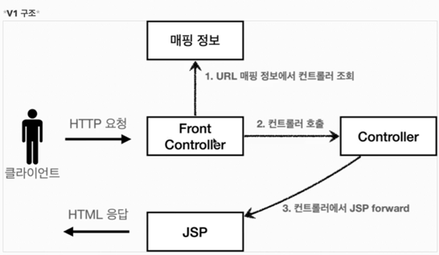
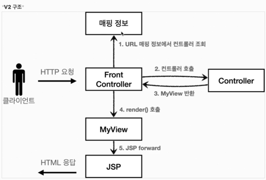
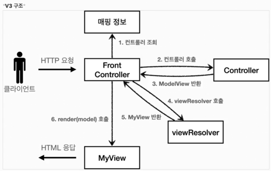
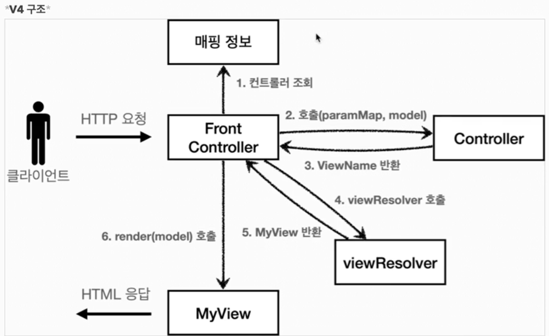
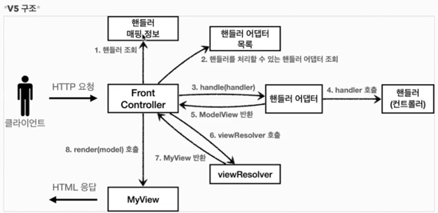
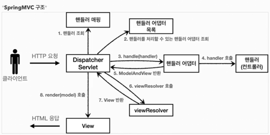

<div align="center">
    <h2>스프링MVC 1편</h2>
</div>

#### http 요청 로그 남기기
- `logging.level.org.apache.coyote.http11=debug` application.properties에 추가
- 단 성능저하를 일으킬 수 있으므로 운영 서버에는 적용시키지 않는 것을 추천

#### HttpServletRequest 개요
- HTTP 요청 메시지를 대신해서 파싱해준다.
- 그 결과를 `HttpServletRequest`객체에 담아서 제공해준다.

- start line
  - HTTP 메서드
  - URL
  - 쿼리 스트링
  - 스키마, 프로토콜
- 헤더
  - 헤더 조회
- 바디
  - form 파라미터 형식 조회
  - mwssage body 데이터 직접 조회

- 임시 저장소 기능
  - 저장: `request.setAttribute(name, value)`
  - 조회: `request.getAttribute(name)`
- 세션 관리 기능
  - `request.getSession(create: true)`

#### HTTP 요청 데이터 개요
- GET : 쿼리 파라미터
- POST : HTML Form
- HTTP message body : 데이터 형식은 주로 JSON을 사용

- 복수 파라미터에서 단일 파라미터 조회
  - `username=sim&username=kim` 인 경우 `request.getParameter()`는 하나의 파라미터만 조회가 가능하므로 `request.getParameterValues()` 를 사용해야 한다.

#### POST HTML Form
- application/x-www-form-urlencoded 형식은 쿼리 파라미터 형식과 동일하다.
- 따라서 쿼리 파리미터 조회 메서드를 그대로 사용하면 된다.
- 즉 `request.getParameter()` 메서드는 GET URL 쿼리 파라미터 형식, POST HTML Form 형식 둘 다 지원하는 것이다.


- POST 방식만 가능하다.
- 단 히든 필드를 스프링이 조회해서 PUT, PATCH 같은 요청들을 마치 동작되는 것처럼 보여주기도 한다.
  - 실은 POST 방식으로 동작하는 것이다.

#### JSON 바디
- JSON 결과를 파싱해서 사용할 수 있는 자바 객체로 변환하려면 Jackson, Gson같은 변환 라이브러리를 추가해서 사용해야 한다.
- 스프링 부트로 Spring MVC를 선택하면 기본으로 Jackson을 제공한다. 

#### HttpServletResponse 기본 사용법
- HTTP 응답코드 지정
- 헤더 생성
- 바디 생성

- 편의 기능 제공
- content-type, 쿠키, Redirect

- response 헤더에 편의 메서드를 사용하여 여러 값들을 지정할 수 있다.
- 쿠키는 쿠키의 명칭과 값, 그리고 쿠키의 유지시간을 설정 할 수 있다.
```java
    private void cookie(HttpServletResponse response) {
//        Set-Cookie: myCookie=good; Max-Age=600;
//        response.setHeader("Set-Cookie", "myCookie=good; Max-Age=600");
        Cookie cookie = new Cookie("myCookie", "good");
        cookie.setMaxAge(600); // 쿠키 유지시간 600초
        response.addCookie(cookie);
    }
```

- 리다이렉트 정보도 저장할 수 있다.
  - 이때 웹 브라우저는 캐시에 있는 정보를 사용하기 때문에 같은 요청을 보낸 경우 변동 사항이 없으므로 304 코드를 반환한다.
  

#### HTTP 응답 데이터 - 단순 텍스트, HTML
- 단순 텍스트 응답
  - `writer.println("ok");`
- HTML 응답
  - html을 반환할 때는 content-type을 `text/html`로 지정해야 한다.
- HTTP API, Message Body JSON 응답
  - ObjectMapper를 사용하여 객체를 JSON 형태로 변환하여 반환시킬 수 있다.
  ```java
    @Override
    protected void service(HttpServletRequest request, HttpServletResponse response) throws ServletException, IOException {
        // Content-Type : application/json
        response.setContentType("application/json");
        response.setCharacterEncoding("utf-8");

        HelloData helloData = new HelloData();
        helloData.setUsername("sim");
        helloData.setAge(26);

        // {"username" : "sim", "age" : 26}
        String result = objectMapper.writeValueAsString(helloData);
        response.getWriter().write(result);

    }
  ```

#### 서블릿과 자바 코드만으로 HTML 만들기
- 서블릿 덕분에 동적으로 원하는 HTML을 만들 수 있었다. 
- 하지만 HTML을 자바로 작성하는 것은 복잡하고 비효율적이다.
```java
w.write("<html>\n" +
        "<head>\n" +
        " <meta charset=\"UTF-8\">\n" + "</head>\n" +
        "<body>\n" +
        "성공\n" +
        "<ul>\n" +
        "    <li>id=" + member.getId() + "</li>\n" +
        "    <li>username=" + member.getUsername() + "</li>\n" +
        " <li>age=" + member.getAge() + "</li>\n" + "</ul>\n" +
        "<a href=\"/index.html\">메인</a>\n" + "</body>\n" +
        "</html>");
```

- 따라서 HMTL문서에 동적으로 변경해야 하는 부분에 자바 코드를 넣을 수 있는 방법이 생겨났다.
- 이를 템플릿 엔진이라고 하고 그 예로 JSP, Thymeleaf, Freemarker, Velocity 등이 있다.

#### JSP 사용
- 의존성 추가
```groovy
//JSP 추가 시작
implementation 'org.apache.tomcat.embed:tomcat-embed-jasper'
implementation 'javax.servlet:jstl' 
//JSP 추가 끝
```

- `<%@ page contentType="text/html;charset=UTF-8" language="java" %>`
  - JSP 문서라는 것을 나타내는 뜻
  - 무조건 이렇게 시작을 한다.
- 자바 코드를 그대로 사용할 수 있다.
  - `<%@ page import="hello.servlet.domain.member.MemberRepository" %>` import문
  - `<% ~~ %>` 자바 코드 입력 부분
  - `<%= ~~ %>` 자바 코드 출력 부분

#### 서블릿과 JSP의 한계
- 서블릿을 사용할 때는 HTML코드가 자바 코드에 섞여 지저분하고 복잡하다.
- JSP를 사용하면 HTML파일을 따로 분리시킬 수 있고 필요한 부분에 대해 자바 코드를 적용했다.
- 하지만 JSP 파일에 비즈니스 로직과 HTML이 공존한다.
- 비즈니스 로직이 노출되고 나중에는 코드의 분량이 엄청나게 증가되므로 관리하기가 어렵다.
- 이런 단점을 해결하고자 MVC 패턴이 등장한다.

#### MVC 패턴의 등장
- 비즈니스 로직은 서블릿 처럼 다른 곳에서 처리하고, JSP는 목적에 맞게 View를 그리는 일에 집중하도록 하자.

- 변경의 라이프 사이클
  - 비즈니스 로직과 UI 사이의 변경의 라이프 사이클은 서로 다르다는 점을 인식해야 한다.
  - UI와 비즈니스 로직의 수정하는 일은 각각 다르게 발생할 가능성이 높다.
  - 이렇게 사이클이 다른 두 부분을 하나의 코드로 관리하는 것은 유지보수하기 좋지 않다.

- 기능 특화
  - JSP같은 뷰 템플릿은 화면을 렌더링 하는데 최적화 되어있기 때문에 이 부분의 업무만 담당하는 것이 좋다.
  
- Model View Controller
- 컨트롤러
  - HHTP 요청을 받아 파라미터를 검증하고 비즈니스 로직을 실행한다.
  - 그리고 뷰에 전달할 결과 데이터를 조회해서 모델에 담는다.
- 모델
  - 뷰에 출력할 데이터를 담아둔다.
  - 뷰가 필요한 데이터를 모두 모델에 담아서 전달해주는 덕분에 뷰는 화며을 렌더링 하는 일에 집중할 수 있다.
- 뷰
  - 모델에 담겨있는 데이터를 사용해서 화면을 그리는 일에 집중한다.

- `dispatcher.forward()`: 다른 서블릿이나 JSP로 이동할 수 있는 기능, 서버 내부에서 다시 호출이 발생한다.

- redirect vs forward
  - 리다이렉트는 실제 클라이언트에 응답이 나갔다가, 클라이언트가 redirect 경로로 다시 요청한다.
  - 따라서 클라이언트가 인지할 수 있고 ,URL 경로도 실제로 변경된다.
  - 포워드는 서버 내부에서 일어나는 호출이기 때문에 클라이언트가 전혀 인지할 수 없다.
  - WEB-INF 아래에 있는 자원들은 외부에서 호출이 불가능하다. 이는 WAS에서의 규칙이다.

- form의 action에서의 상대경로
  - 절대경로: 해당 경로 그대로 호출
  - 상대경로: `현재 URL이 속한 계층 경로 + 상대경로`로 호출된다.

- `<%@ taglib prefix="c" uri="http://java.sun.com/jsp/jstl/core"%>` JSP 내부에서 `<C:forEach>`를 사용하기 위해서 라이브러리가 필요하다.

#### MVC패턴의 한계
 - 컨트롤러가 현재 중복이 많고 불필요한 코드들이 많이 보인다.
 - 포워드 중복
   - View로 이동하는 코드가 항상 중복으로 호출된다.
   ```java
    RequestDispatcher dispatcher = request.getRequestDispatcher(viewPath);
    dispatcher.forward(request, response);
    ```
    - `HttpServletRequest`, `HttpServletResponse` 를 사용하는 코드는 테스트 코드 작성하기에 어렵다.
 
 - 공통 처리가 어렵다.
   - 기능이 복잡해질 수록 컨트롤러에서 공통으로 처리해야 하는 부분이 점점 증가할 것이다. 
   - 공통 기능을 메서드로 뽑아도 해당 메서드를 항상 호출해야 한다.
 - 이 문제를 해결하기 위해 컨트롤러 호출 전에 먼저 공통 기능을 처리해야 한다.
 - 프론트 컨트롤러 패턴을 도입하면 이런 문제를 해결할 수 있다.(입구를 하나로)
 - 스프링 MVC의 핵심도 바로 이 프론트 컨틀롤러에 있다.

#### 프론트 컨트롤러 패턴
- 프론트 컨트롤러 서블릿 하나로 클라이언트의 요청을 받음
- 요청에 맞는 컨트롤러를 찾아서 호출
- 공통  처리 가능
- 프론트 컨트롤러를 제외한 나머지 컨트롤러는 서블릿을 사용하지 않아도 됨


#### 프론트 컨트롤러 도입 - v1


- 각 컨트롤러들은 인터페이스를 구현한다.
- 프론트 컨트롤러는 앞으로 이 인터페이스를 호출해서 구현과 상관없이 로직의 일관성을 가져갈 수 있다.

#### 프론트 컨트롤러 도입 - V2


```java
String viewPath = "/WEB-INF/views/new-form.jsp";
RequestDispatcher dispatcher = request.getRequestDispatcher(viewPath);
dispatcher.forward(request, response);
```

- V1의 모든 컨트롤러에서 뷰로 이동하는 부분에 중복이 있고 깔끔하지 못하다.
- 이 부분을 깔끔하게 분리하기 위해 별도로 뷰를 처리하는 객체를 만들자

- MyView 객체를 만들어서 요청에 따라 필요한 JSP를 불러와서 전달하도록 만들어서 중복되는 코드를 줄였다.

#### Model 추가 - V3


- 서블릿 종속성 제거
  - 컨트롤러 입장에서 HttpServletRequest, response가 꼭 필요할까?
  - 요청 파라미터 정보는 Map으로, request 객체를 Model로 사용하는 대신에 별도의 Model객체를 만들어서 반환하면 된다.
  - 이렇게 한다면 구현 코드도 매우 단순해지고, 테스트 코드 작성도 쉬워진다.
- 뷰 이름 중복 제거
  - 컨트롤러에서 지정하는 뷰 이름에 중복이 있는 것을 볼 수 있다.
    - `/WEB-INF/views/members.jsp`
  - 컨트롤러는 뷰의 논리 이름을 반환하고, 실제 물리 위치의 이름은 프론트 컨트롤러에서 처리하도록 단순화 하자.
  - 이렇게 한다면 뷰의 폴더 위치가 변경됐을 때 프론트 컨트롤러만 고치면 된다.

- ModelView
  - 서블릿의 종속성을 제거하기 위해 Model을 직접 만들고, 추가로 View 이름까지 전달하는 객체를 만들어 보자
  - 뷰의 이름과 뷰를 렌더링 할 때 필요한 model객체를 가지고 있다.
  - 단순히 컨트롤러에서 뷰에 필요한 데이터를 key, value에 넣어주면 된다.

- 종속성 제거
  - 이제 FrontController는 서브릿에 대해 종속성이 제거된 모습을 볼 수 있다.
  ```java
        @Override
    protected void service(HttpServletRequest request, HttpServletResponse response) throws ServletException, IOException {

        String requestURI = request.getRequestURI();
        ControllerV3 controller = controllerMap.get(requestURI);
        if (controller == null) {
            response.setStatus(HttpServletResponse.SC_NOT_FOUND);
            return;
        }

        // paramMap
        Map<String, String> paramMap = createParamMap(request);
        ModelView mv = controller.process(paramMap);
        String viewName = mv.getViewName();  // 논리이름 new-form

        MyView view = viewResolver(viewName);
        view.render(mv.getModel(), request, response);

    }
  ```
  
- 뷰 리졸버
  - 컨트롤러가 반환한 논리 뷰 이름을 실제 물리 뷰 경로로 변경한다. 
  - 그리고 실제 물리 경오가 있는 MyView 객체를 반환한다.
  - 논리 뷰 이름: `members`
  - 물리 뷰 경오: `/WEB-INF/views/members.jsp`
  - 이렇게 하는 이유는 나중에 물리 경로가 변경되었을 때 모든 컨트롤러를 돌아 다니면서 경로를 수정할 필요가 없기 때문이다.
  - 오직 뷰 리졸버에서만 경로를 수정해주면 된다.

#### 단순하고 실용적인 컨트롤러 - V4


- 실제 컨트롤러 인터페이스를 구현하는 개발자 입장에서 보면, 항상 ModelView 객체를 생성하고 반환해야 하는 부분이 조금 번거롭다.
- 좋은 프레임워크는 아키텍처도 중요하지만, 실제 개발하는 개발자가 단순하고 편리하게 사용할 수 있어야 한다. 즉 실용성이 있어야 한다.
- 기본적인 구조는 V3와 동일하다. 대신 컨트롤러가 ModelView를 반환하지 않고 ViewName만 반환한다.

- 기존 구조에서 모델을 파라미터로 넘기고, 뷰의 논리 이름을 반환한다는 아이디어를 적용했더니, 컨트롤러 개발자 입장에서 군더더기 없는 코드를 작성할 수 있게 되었다.

#### 유연한 컨트롤러1 - V5


- 어떤 개발자는 `ControllerV3` 방식으로 개발하고 싶고, 어떤 개발자는 `ControllerV4` 방식으로  개발하고 싶다면?
  - 현재 코드로는 불가능하다.
- 어댑터 패턴을 사용하면 프론트 컨트롤러가 다양한 방식의 컨트롤러를 처리할 수 있도록 변경할 수 있다.

1. 우선 핸들러 매핑 정보를 조회하여 핸들러를 찾는다.
2. 그리고 핸들러를 처리할 수 있는 핸들러 어댑터를 조회한다. 
   - 마치 110V를 사용하기 위해 어댑터를 찾는 과정이라고 생각하면 된다.
3. 그 후 핸들러 어댑터의 `handle` 함수를 호출하여 컨트롤러를 대신 호출하도록 한다.
4. 결과값을 받아 `FrontController`에게 반환하고 `ViewResolver`를 호출한다.
5. `ViewResolver`는 `View`를 반환해주고 해당 `View`에 아까 받은 데이터를 넣어서 응답해준다.

- 핸들러 어댑터: 중간에 어댑터 역할을 하는 어댑터가 추가되었다. 여기서 어댑터 역할을 해주는 덕분에 다양한 종류의 컨트롤러를 호출할 수 있다.
- 핸들러: 컨트롤러의 이름을 더 넓은 범위인 핸들러로 변경했다. 어댑터가 있기 때문에 꼭 컨트롤러의 개념 뿐만 아니라 어떠한 것이든 해당하는 종류의 어댑터만 존재하면 모두 처리가 가능하기 때문이다.

#### 유연한 컨트롤러2 - V5
- 핸들러 정보들을 다음과 같이 등록만 해놓으면 타입에 상관없이 다양한 요청들을 처리할 수 있다.
```java
    static void init(Map<String, Object> handlerMappingMap) {
        handlerMappingMap.put("/front-controller/v5/v3/members/new-form", new MemberFormControllerV3());
        handlerMappingMap.put("/front-controller/v5/v3/members/save", new MemberSaveControllerV3());
        handlerMappingMap.put("/front-controller/v5/v3/members", new MemberListControllerV3());
        handlerMappingMap.put("/front-controller/v5/v4/members/new-form", new MemberFormControllerV4());
        handlerMappingMap.put("/front-controller/v5/v4/members/save", new MemberSaveControllerV4());
        handlerMappingMap.put("/front-controller/v5/v4/members", new MemberListControllerV4());
    }
```

#### 스프링 MVC 전체 구조


- `DispatcherServlet`
  - 스프링 MVC도 프론트 컨트롤러 패턴으로 구현되어 있다.
  - 스프링 MVC의 프론트 컨트롤러가 디스패쳐 서블릿이다.
- `DispatcherServlet` 서블릿 등록
  - `DispatcherServlet`도 부모 클래스에서 `HttpServlet`을 상속 받는다.
  - 스프링 부트는 `DispatcherServlet`를 서블릿으로 자동으로 등록하면서 모든 경로에 대해 매핑한다.
- 요청 흐름
  - 서블릿이 호출되면 `HttpServlet`이 제공하는 `service()`가 호출된다.
  ```java
      @Override
    protected void service(HttpServletRequest request, HttpServletResponse response)
            throws ServletException, IOException {

        HttpMethod httpMethod = HttpMethod.resolve(request.getMethod());
        if (httpMethod == HttpMethod.PATCH || httpMethod == null) {
            processRequest(request, response);
        }
        else {
            super.service(request, response);
        }
    }
  ```
  
  - `FrameworkServlet.service()` 를 시작으로 여러 메서드가 호출되면서 `DispacherServlet.doDispatch()` 가 호출된다.
  - `doDispatch()` 메서드가 제일 중요하다.
- 동작 순서
1. 핸들러 조회 : 핸들러 맵핑을 통해 요청 URL에 맵핑된 핸들러(컨트롤러)를 조회한다.
2. 핸들러 어댑터 조회 : 핸들러를 실행할 수 있는 핸들러 어댑터를 조회한다.
3. 핸들러 어댑터 실행 : 핸들러 어댑터를 실행한다.
4. 핸들러 실행 : 핸들러 어댑터가 실제 핸들러를 실행한다.
5. ModelAndView 반환 : 들러 어댑터는 핸들러가 반환하는 정보를 ModelAndView로 변환해서 반환한다.
6. viewResolver 호풀 : 뷰 리졸버를 찾고 실행한다.
7. View 반환 : 뷰 리졸버는 뷰의 논리 이름을 물리 이름으로 바꾸고, 렌더링 역할을 담당하는 뷰 객체를 반환한다.
8. 뷰 렌더링 : 뷰를 통해서 뷰를 렌더링한다.

- 인터페이스 살펴보기
  - 스프링 MVC의 강점은 DispatcherServlet코드의 변경 없이 원하는 기능을 변경하거나 확장할 수 있다는 점이다.
- 주요 인터페이스 목록
  - 핸들러 매핑: org.springframework.web.servlet.HandlerMapping 
  - 핸들러 어댑터: org.springframework.web.servlet.HandlerAdapter 
  - 뷰 리졸버: org.springframework.web.servlet.ViewResolver
  - 뷰: org.springframework.web.servlet.View

#### 핸들러 맵핑과 핸들러 어댑터
- OldController
  ```java
    @Component("/springmvc/old-controller")  // 스프링 빈의 이름을 url 패턴으로 설정한 것
    public class OldController implements Controller {

      @Override
      public ModelAndView handleRequest(HttpServletRequest request, HttpServletResponse response) throws Exception {
          System.out.println("OldController.handleRequest");
          return null;
      }

  }
  ```

- 핸들러 맵핑 : 핸들러 맵핑에서 이 컨트롤러를 찾을 수 있어야 한다.
- 핸들러 어댑터 : 핸들러 맵핑을 통해서 찾은 핸들러를 실행할 수 있는 핸들러 어댑터가 필요하다.
  - 'Controller'인터페이스를 실행할 수 있는 핸들러 어댑터를 찾고 실행해야 한다.
- HandlerMApping
```
0 = RequestMappingHandlerMapping : : 애노테이션 기반의 컨트롤러인 @RequestMapping에서 사용
1= BeanNameUrlHandlerMapping : 스프링 빈의 이름으로 핸들러를 찾는다.
```

- HandlerAdapter
```
0 = RequestMappingHandlerAdapter : 애노테이션 기반의 컨트롤러인 @RequestMapping에서 사용
1 = HttpRequestHandlerAdapter : HttpRequestHandler 처리
2 = SimpleControllerHandlerAdapter : Controller 인터페이스(애노테이션X, 과거에 사용) 처리
```

- 과정
  1. 핸들러 맵핑으로 핸들러 조회
     - HandlerMapping을 순서대로 찾아서 핸들러를 찾는다.
  2. 핸들러 어댑터 조회
     - HandlerAdapter의 supports()를 순서대로 호출
     - SimpleControllerHandlerAdapter가 Controller 인터페이스를 지원하므로 대상이 된다.
  3. 핸들러 어댑터 실행
     - DispatcherServlet이 조회한 SimpleControllerAdapter를 실행하면서 핸들러 정보도 함께 넘겨준다.
     - 그 내부에서 핸들러인 OldController를 실행하고 결과를 반환한다.

#### 뷰 리졸버
- InternalResourceViewResolver
  - 스프링 부트는 이 뷰 리졸버를 자동으로 등록한다.
  - 이때 `application.properties`에 등록한 아래 내용들을 설정 정보로 사용해서 등록한다.
  ```groovy
  spring.mvc.view.prefix=/WEB-INF/views/
  spring.mvc.view.suffix=.jsp
  ```
  
- 스프링 부트가 자동 등록하는 뷰 리졸버
```
1 = BeanNameViewResolver : 빈 이름으로 뷰를 찾아서 반환한다. (예: 엑셀 파일 생성 기능에 사용)
2 = InternalResourceViewResolver : JSP를 처리할 수 있는 뷰를 반환한다.
```

- 과정
  1. 핸들러 어댑터 호출
  2. ViewResolver 호출
     - `new-form`이라는 뷰 이름으로 viewResolver를 순서대로 호출한다.
     - 이때 `InternalResourceViewResolver`가 호출된다.
  3. InternalResourceResolver
     - `InternalResourceView`를 반환한다.
  4. 뷰 - InternalResourceView
     - InternalResourceView는 JSP처럼 `forward()`를 호출해서 처리할 수 있는 경우에 사용한다.
  5. view.render()
     - `view.render()`가 호출되고, InternalResourceView는 `forward()`를 사용해서 JSP를 실행한다.

#### 스프링 MVC - 시작하기
- `@RequestMapping`
  - RequestMappingHandlerMapping
  - RequestMappingHandlerAdapter
  - 위 두개가 제일 우선순위가 높은 핸들러, 핸들러 어댑터이다.
- `@Controller`
  - 자동으로 스프링 빈으로 등록한다.
  - 스프링 MVC에서 어노테이션 기반 컨트롤러로 자동 인식한다.
- RequestMappingHandlerMapping
  - 이 핸들러는 `@RequestMapping`  또는 `@Controller`어노테이션이 클래스 레벨에 붙어 있는 경우에 앱핑 정보로 인식한다.
  - 따라서 아래와 같은 방식으로 작성할 수도 있다.
  ```java
    @Component
    @RequestMapping
    public class SpringMemberFromControllerV1 {
    
        @RequestMapping("/springmvc/v1/members/new-form")
        public ModelAndView process() {
            return new ModelAndView("new-form");
        }
    }
  ```
  
  - 'ReqeustMappingHandlerMapping.class'
  ```java
   @Override
   protected boolean isHandler(Class<?> beanType) {
      return (AnnotatedElementUtils.hasAnnotation(beanType, Controller.class) ||
				AnnotatedElementUtils.hasAnnotation(beanType, RequestMapping.class));
   }  
  ```
  
